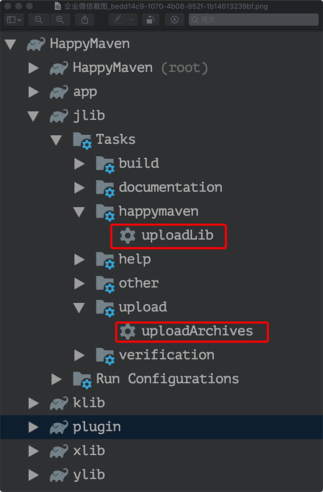

# HappyMaven
> Provide an easy way to publish your archives(AARS or JARS) to Maven Central


[](https://search.maven.org/search?q=g:%22engineer.echo%22%20AND%20a:%22happymaven%22)


### Ⅰ.Quick Start

1. dependence happymaven

    ```
    buildscript {
        repositories {
            mavenCentral()
        }
        dependencies {
            classpath 'engineer.echo:happymaven:0.0.9'
        }
    }
    ```

2. [sonatype account](https://issues.sonatype.org) and **sign key**(gpg secret key)  in `~/.gradle/gradle.properties` (or `Users/your name/.gradle/gradle.properties`)

    ```
    NEXUS_USER_NAME = yourUsername
    NEXUS_PASSWORD = yourPassword
    signing.keyId=gpg secret key id like B1855705
    signing.password=gpg key password
    signing.secretKeyRingFile=/Users/your name/.gnupg/secring.gpg
    ```

3. root project config  [reference](https://github.com/Pluckypan/HappyMaven/blob/master/build.gradle)

    ```groovy
    ext.HappyMaven = [
            "GROUP_ID"         : "engineer.echo",
            "PACKAGING"        : "aar",
            "LICENSE_NAME"     : "The Apache Software License, Version 2.0",
            "LICENSE_URL"      : "http://www.apache.org/licenses/LICENSE-2.0.txt",
            "LICENSE_DIST"     : "repo",
            "DEVELOPER_ID"     : "pluckypan",
            "DEVELOPER_NAME"   : "Plucky Pan",
            "RELEASE_REPO_URL" : "https://oss.sonatype.org/service/local/staging/deploy/maven2/",
            "SNAPSHOT_REPO_URL": "https://oss.sonatype.org/content/repositories/snapshots/",
            "NEXUS_USER_NAME"  : NEXUS_USER_NAME,
            "NEXUS_PASSWORD"   : NEXUS_PASSWORD
    ]
    ```  

4. library module config [reference](https://github.com/Pluckypan/HappyMaven/blob/master/ylib/build.gradle)

    ```groovy
    apply plugin: 'happy-maven'
    
    HappyMaven {
        artifactId = "ylib"
        version = "0.0.1"
    }
    ```

5. upload archives

 
 
 or run 
 
 ```
 ./gradlew ylib:uploadArchives
 ```

### Ⅱ.Reference Documents
1. mavenCentral()  [maven](https://issues.sonatype.org)
    - release url [`https://oss.sonatype.org/service/local/staging/deploy/maven2/`](https://oss.sonatype.org/service/local/staging/deploy/maven2/)
    - snapshot url [`https://oss.sonatype.org/content/repositories/snapshots/`](https://oss.sonatype.org/content/repositories/snapshots/)
    - search your library [`https://search.maven.org/`](https://search.maven.org/)
    - check staging repositories [`https://oss.sonatype.org/#stagingRepositories`](https://oss.sonatype.org/#stagingRepositories) 
    - more help -> [发布Maven构件到中央仓库](https://my.oschina.net/songxinqiang/blog/313226) &  [sonatype issue](http://www.echo.engineer/c/sonatype.html)
    
2. jcenter()  [bintray](https://bintray.com/)
    - **not support yet.coming soon**
    - search `https://bintray.com/search?query=happymaven`
    
3. gen gpg secret key (Mac)
    - `brew install gnupg `
    - or download dmg form [http://www.gpgtools.org/](http://www.gpgtools.org/)
    - test gpg `gpg --help` or `gpg --version`
    - gen key `gpg --full-generate-key`
    - output secret key: `gpg -o .gnupg/secring.gpg  --export-secret-keys`
    - send publish key `gpg --keyserver  http://pool.sks-keyservers.net:11371/ --send-keys B1855705`
      or `gpg --keyserver http://keyserver.ubuntu.com:11371/ --send-keys B1855705`


### Ⅲ.Full Global Config in rootProject `build.gradle`

```
ext.HappyMaven = [
        "GROUP_ID": "engineer.echo",
        "ARTIFACT_ID": "happymaven",
        "VERSION": "0.0.4",

        "PACKAGING": "aar",

        "RELEASE_REPO_URL": "https://oss.sonatype.org/service/local/staging/deploy/maven2/",
        "SNAPSHOT_REPO_URL": "https://oss.sonatype.org/content/repositories/snapshots/",
        "NEXUS_USER_NAME": "plucky",
        "NEXUS_PASSWORD": "xxxxxx",

        "POM_NAME": "HappyMaven",
        "POM_DESC": "Easy to publish android library.",
        "POM_URL": "https://github.com/Pluckypan/HappyMaven",

        "SCM_URL": "https://github.com/Pluckypan/HappyMaven.git",
        "SCM_CONNECTION": "scm:git@github.com:Pluckypan/HappyMaven.git",
        "SCM_DEV_CONNECTION": "scm:git@github.com:Pluckypan/HappyMaven.git",

        "LICENSE_NAME": "The Apache Software License, Version 2.0",
        "LICENSE_URL": "http://www.apache.org/licenses/LICENSE-2.0.txt",
        "LICENSE_DIST": "repo",

        "DEVELOPER_ID": "pluckypan",
        "DEVELOPER_NAME": "Plucky Pan"
]
```

### Ⅳ.Full Module Config in library module `build.gradle`

```
apply plugin: 'happy-maven'

HappyMaven {
    groupId = "engineer.echo"
    artifactId = "happymaven"
    version = "0.0.4"

    packaging = "aar"
    
    releaseRepoUrl = "https://oss.sonatype.org/service/local/staging/deploy/maven2/"
    snapshotRepoUrl = "https://oss.sonatype.org/content/repositories/snapshots/"
    nexusUserName = "plucky"
    nexusPassword = "xxxxxx"

    pomName = "HappyMaven"
    pomDesc = "Easy to publish android library."
    pomUrl = "https://github.com/Pluckypan/HappyMaven"

    scmUrl = "https://github.com/Pluckypan/HappyMaven.git"
    scmConnection = "scm:git@github.com:Pluckypan/HappyMaven.git"
    scmDevConnection = "scm:git@github.com:Pluckypan/HappyMaven.git"

    licenseName = "The Apache Software License, Version 2.0"
    licenseUrl = "http://www.apache.org/licenses/LICENSE-2.0.txt"
    licenseDist = "repo"

    developerId = "pluckypan"
    developerName = "Plucky Pan"
}
```

V. TODO

Ⅵ. License

```
Copyright [2019] [Plucky Pan]

Licensed under the Apache License, Version 2.0 (the "License");
you may not use this file except in compliance with the License.
You may obtain a copy of the License at

   http://www.apache.org/licenses/LICENSE-2.0

Unless required by applicable law or agreed to in writing, software
distributed under the License is distributed on an "AS IS" BASIS,
WITHOUT WARRANTIES OR CONDITIONS OF ANY KIND, either express or implied.
See the License for the specific language governing permissions and
limitations under the License.
```